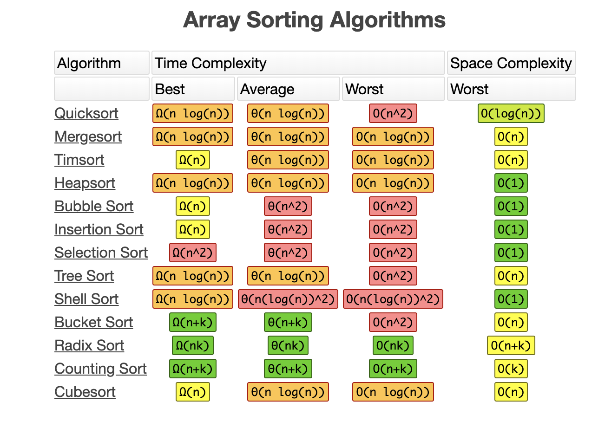

# Sorting Algorithms
{: .fs-9 }

A sorting algorithm is an algorithm that puts the elements of a list in a certain order.
{: .fs-6 .fw-300 }

[Get started now](#data-structures-vs-apis){: .btn .btn-primary .fs-5 .mb-4 .mb-md-0 .mr-2 } [View examples on GitHub](https://github.com/Iretha/data-structures-and-algorithms){: .btn .fs-5 .mb-4 .mb-md-0 }

---
## Properties of a sorting algorithm

### Is it stable?
Stable sorting algorithms maintain the relative order of records with equal keys (i.e. values). 
A sorting algorithm is stable if whenever there are two records R and S with the same 
key and with R appearing before S in the original list, R will appear before S in the sorted list.

* Example

If you have a list of books, ordered by title (alphabetically). Then you have a 
requirement to sort them by their publish date.
If the algorithm is stable, the books will be sorted by publish date,
BUT the books, published on the same date, will keep the alphabetical order as well.

### Does it take an extra space or is in-lace sorting (Space Complexity)?
It is in-place sorting, when the elements get reordered in the same instance of the data structure.
Not in-place sorting is when the sorted elements are returned in another instance. This means that the
algorithm requires an extra space, because it creates/ generates new instances.

* Example

Bubble sort is in-place sorting algorithm and does not require an extra space, so it's space complexity is O(1).
On the other side, the merge sort creates new arrays and  it takes Θ(n) extra space for arrays.

#### Array Sorting Algorithms

### How many comparisons or swaps are performed (Time Complexity)?
How many iterations are needed and what is the time complexity?
This requires some understanding in [Big O Notation](/big-o-notation)

### Is it adaptive or non-adaptive?
Adaptive algorithms change their performance (complexity) based on some conditions.
Some adaptive algorithms reduce their complexity if the data is nearly sorted. 
For example the time complexity of Bubble Sort is reduced from O(n^2) to O(n), if the array is nearly sorted.
If it was a non-adaptive algorithm, it would take O(n^2) no matter what.

Non-adaptive algorithms have the advantage of simplicity, Adaptive is often faster, 
but the algorithm is more complex.
Timsort is an adaptive merge sort that is widely used. Heapsort and quicksort are non-adaptive.

[Sorting Algorithm](https://en.wikipedia.org/wiki/Sorting_algorithm)
[Sorting Algorithms Visualisations](https://www.toptal.com/developers/sorting-algorithms)
