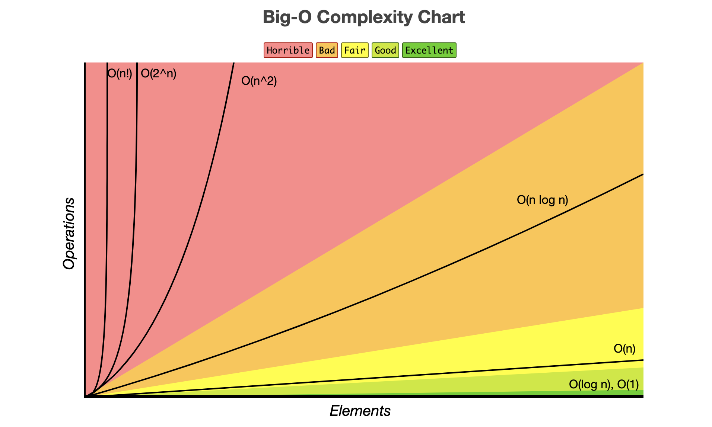
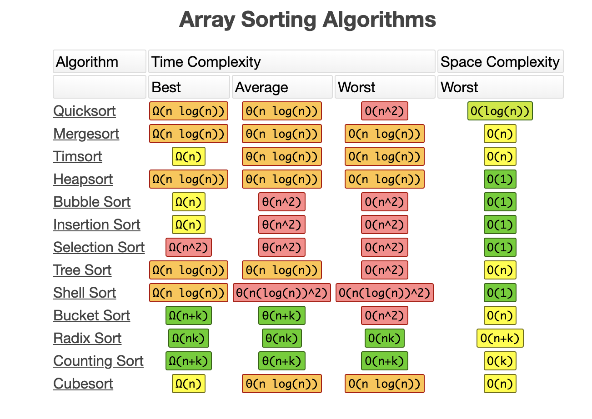

# The Big O Notation (aka Time/ Memory Complexity)
{: .fs-9 }

This is a mechanism to measure the efficiency of a program in context of speed or memory usage.
When it comes to speed, it is also called **"time complexity"** of the algorithm.
{: .fs-6 .fw-300 }

---

## Complexity types:
### Constant Time - O(1) : Random Access (By Index)
The fastest one. It always takes a constant time to do something, regardless the the number of the elements in the collection. 

I.e. To access to element in an array by it's index.

### Logarithmic Time - O(log N) : Search Algorithms (In Sorted Collections)
```java
 for (x = n; x >= 1; x = x/2) {
        console.log(x);
    }
```
I.e. if it takes 1 second to compute 10 elements, it will take 2 seconds to compute 100 elements, 
3 seconds to compute 1000 elements, and so on. An example is the binary search.

### Linear Time - O(N) : Looping a collection
We have linear time, when the complexity depends on the number of the elements. If the number of elements increases/ decreases, 
the time also increases/ decreases with the same rate (linearly).

- If you loop a 1/2 of the collection, it's still a linear time O(N). O(N/2) = O(N)

- If you loop a collection 3 times independently, it is still a linear time O(N). O(3N) = O(N)

- If you loop two different collections in a single algorithm, you should add their times: O(N + M)

I.e. when we have to iterate the elements of a collection to do/ find something i.e. to find an element in an array.

### Quasilinear Time - O(N log N) : Sorting algorithms

I.e. when each element have to be compared with every other element.

### Quadratic Time - O(N^2) : Nesting loops
- When you have nested loops ON THE SAME COLLECTION, then the power depends on the count of the nested loops O(N^2) or O(N^3) and so on...

- When you have nested loops ON TWO DIFFERENT COLLECTIONS, then time will be O(N * M).

- When you have nested loops ON THREE DIFFERENT COLLECTIONS, then time will be O(N * M * P) and so on.

Power of 2 => O(n^2):
```java
for(){
    for(){
    
    }
}
```

Power of 3 => O(n^3):
```java
for(){
    for(){
        for(){
        
        }
    }
}
```
### Exponential Time - O(2^n) / 0(N!)
We have exponential time, when the complexity depends on the number of the elements. If the number of elements increases/ decreases, 
the time also increases/ decreases with double rate.

I.e. when a function calls itself twice (recursion when calculating fibonacci) or iterating binary trees (because they have 2 paths - left & right)


### Ordering (from fastest to slowest):
1). Constant: O(1), Logarithmic: O(log n)

2). Linear: O(n)

3). O(n log n)

4). Exponential: O(n^2) 

5). Exponential: O(n^3) 

6). Exponential: O(2^n)

7). Exponential/ Factorial: O(n!)

Exponential times are really slow! Try to optimize them!

### Rules when calculating:
* Drop the constants: O(3N) -> O(N)
* Drop non-dominant: O(N + N^2) -> O(N^2)

## Complexity Cheat Sheets:
Source: [www.bigocheatsheet.com](https://www.bigocheatsheet.com/)

### Complexity Chart

Source: [www.bigocheatsheet.com](https://www.bigocheatsheet.com/)

### Common Data Structure Operations

Source: [www.bigocheatsheet.com](https://www.bigocheatsheet.com/)

### Array Sorting Algorithms

Source: [www.bigocheatsheet.com](https://www.bigocheatsheet.com/)

## Discussion

### How we can compare the runtime characteristics of an algorithm or operations in a Data Structure
We could use The Big O Notation to measure the performance of the algorithms, so that we can compare them.

### What means "to describe to runtime characteristics"
You should calculate the time (or memory) complexity of the algorithm or so called "Big O Notation".

### How to calculate the time (or memory) complexity
Just memorize the cheat sheets with the complexity of most common operations/ algorithms.
Remember the order of the complexity types in terms of efficiency and be careful if you have one or multiple collections.