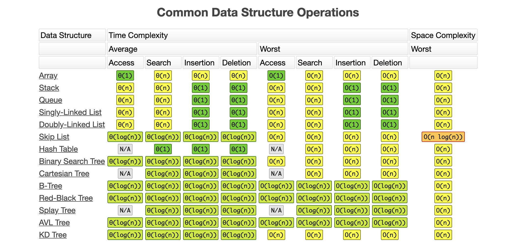

# Data Structures
{: .fs-9 }

{: .fs-6 .fw-300 }

[Get started now](#data-structures-vs-apis){: .btn .btn-primary .fs-5 .mb-4 .mb-md-0 .mr-2 } [View examples on GitHub](https://github.com/Iretha/data-structures-and-algorithms){: .btn .fs-5 .mb-4 .mb-md-0 }

---

# Data Structures vs APIs

APIs are build on top on the Data Structures and they add additional functionalities to the basic data structures.

Data Structure| |APIs
---|---|---
Array|->|ArrayList
Linked List|->|Stacks & Queues
Array + Linked List|->|HashTable
Binary Tree| -> | Binary Heap

# Comparison
